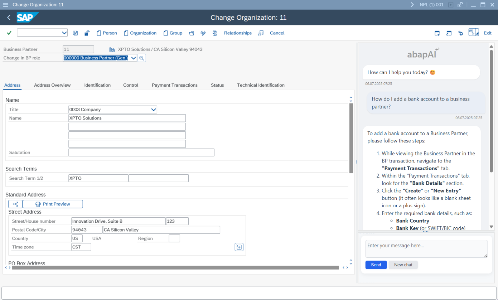
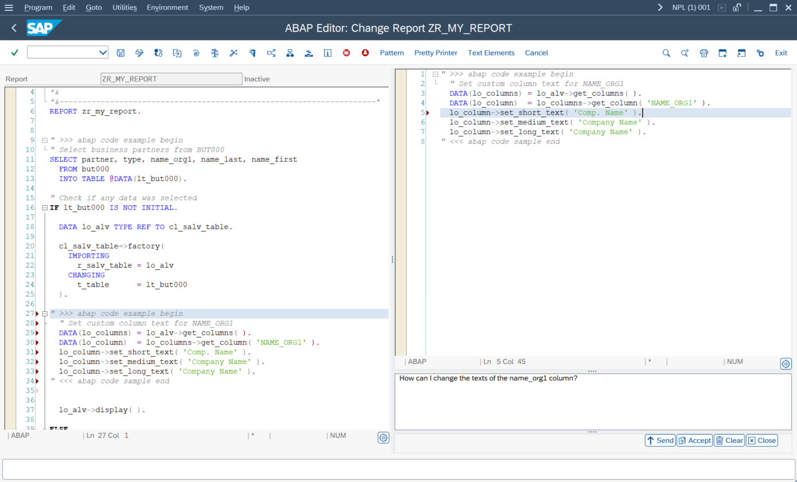

# yaai - ABAP AI tools
This repository provides a set of tools designed to facilitate Artificial Intelligence capabilities within ABAP environments.

## Key Features
- **Multi-Provider LLM API Support**: ABAP AI tools support seamless integration with multiple large language model APIs, giving you flexibility in choosing your provider and deployment model. The list of supported APIs will continue to grow as the project evolves. Currently supported APIs include:
  - **[OpenAI](openai/README.md)**
  - **[Anthropic](anthropic/README.md)**
  - **[Google Gemini](google/README.md)**
  - **[Mistral](openai_compatible/mistral.md)**
  - **[Ollama](ollama/README.md)**
  - APIs from other providers, such as Nvidia, that implement the OpenAI API standards also work with ABAP AI tools, possibly requiring minor adjustments.
      
      - **[Nvidia](openai_compatible/nvidia.md)**
      
- **Conversation Management**: Maintain and manage multi-turn conversations, with full access to conversation history for advanced chat scenarios.
- **Tool/Function Calling**: Integrate ABAP business logic with LLMs using function/tool calling, allowing AI models to trigger ABAP methods.
- **Retrieval-Augmented Generation (RAG)**: Enhance LLM outputs by incorporating enterprise data, enabling more accurate and relevant answers through retrieval-augmented generation workflows.
- **AI Agents Development**: The ABAP AI tools now have the same features as the cloud version, with a primary focus on AI Agent development. All tooling is specifically designed to support ABAP developers in building and testing AI Agents.

These features empower you to build intelligent, enterprise-ready ABAP applications that leverage the latest advancements in AI.

[**ABAP AI tools Cockpit**](https://github.com/christianjianelli/yaai_cockpit)
Configuring AI agents in ABAP AI tools involves maintaining a bunch of database tables. To make this whole process easier, the ABAP AI tools Cockpit was built. It’s a frontend application designed to streamline the development of AI agents created with ABAP AI tools Cloud.

  

For a ready-to-use user interface—including chat and code assistance apps—check out our companion project: 

  [**yaai ui - ABAP AI User Interface**](https://github.com/christianjianelli/yaai_ui)
  The ABAP AI UI repository provides interfaces to interact with LLMs directly from your SAP system.
  
  

    
     <a href="https://github.com/christianjianelli/yaai_ui">ABAP AI Chat</a>
     
     
    
     <a href="https://github.com/christianjianelli/yaai_ui">ABAP AI Code Assistant</a>
  

# Get Started

  - [Installation](installation.md): See how to install ABAP AI.
  - [Quickstart](quickstart.md): Run your first ABAP AI applications.
  - [Configuration](config.md): See how to configure Connections.

# APIs

  - [OpenAI Guide](openai/README.md): Learn how to use ABAP AI with OpenAI models.
  - [Ollama Guide](ollama/README.md): Learn how to use ABAP AI with with local or self-hosted Ollama models.
  - [Google Gemini Guide](google/README.md): Learn how to use ABAP AI with Google Gemini models.
  - [Anthropic Guide](anthropic/README.md): Learn how to use ABAP AI with Anthropic models.

# Features
- [System Instructions](system_instructions.md): Learn how to pass System Instructions to a LLM.
- [Prompt Templates](prompt_templates.md): Learn how to use Prompt Templates.
- [Function Calling](function_calling.md): Learn how to use Function Calling.
- [Retrieval-Augmented Generation (RAG)](rag.md): Enhance your LLM applications by incorporating external knowledge sources and retrieval mechanisms.