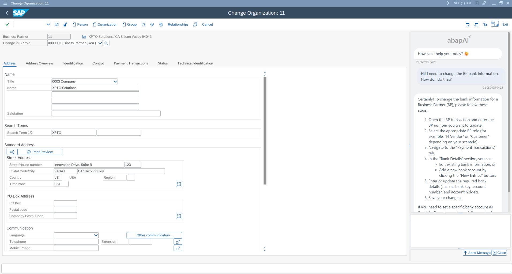
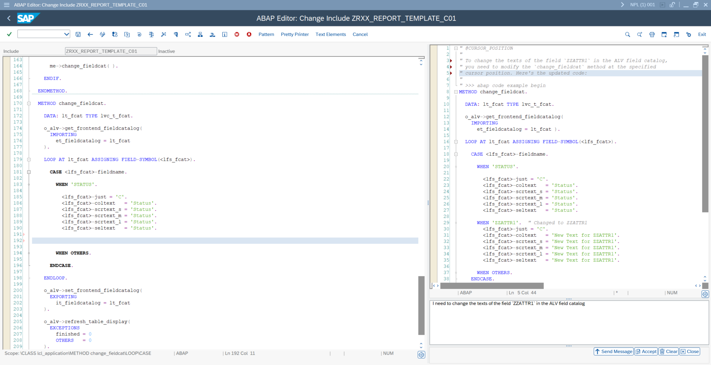

# yaai - ABAP AI tools
This repository provides a set of tools designed to facilitate Artificial Intelligence capabilities within ABAP environments.

## Key Features
- **OpenAI and Ollama Support**: Seamlessly connect your ABAP applications to both OpenAI (cloud-based) and Ollama (local/self-hosted) LLM APIs, enabling flexible deployment options.
- **Conversation Management**: Maintain and manage multi-turn conversations, with full access to conversation history for advanced chat scenarios.
- **Tool/Function Calling**: Integrate ABAP business logic with LLMs using function/tool calling, allowing AI models to trigger ABAP methods.
- **Retrieval-Augmented Generation (RAG)**: Enhance LLM outputs by incorporating enterprise data, enabling more accurate and relevant answers through retrieval-augmented generation workflows.

These features empower you to build intelligent, enterprise-ready ABAP applications that leverage the latest advancements in AI.

This repository focuses on backend AI integration for ABAP. For a ready-to-use user interface—including chat and code assistance apps—check out our companion project: 

  [**yaai ui - ABAP AI User Interface**](https://github.com/christianjianelli/yaai_ui)
  The ABAP AI UI repository provides interfaces to interact with LLMs directly from your SAP system.
  
  

    <a href="https://github.com/christianjianelli/yaai_ui">
      
      
       ABAP AI Chat and Code Assistant
    </a>
  

# Get Started

  - [Installation](installation.md): Learn how to install ABAP AI.
  - [Quickstart](quickstart.md): Run your first ABAP AI applications.
  - [Configuration](configuration.md): See how to configure Connections.

# APIs

  - [OpenAI Guide](openai/README.md): Learn how to configure and use ABAP AI with OpenAI models.
  - [Ollama Guide](ollama/README.md): Learn how to configure and use ABAP AI with with local or self-hosted Ollama models.

# Features
- [System Instructions](system_instructions.md): Run your first ABAP AI applications.
- [Prompt Templates](prompt_templates.md): Run your first ABAP AI applications.
- [Function Calling](quickstart.md): Run your first ABAP AI applications.