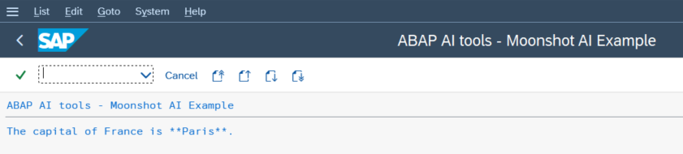

# yaai - ABAP AI tools - Moonshot AI

<p>
  
</p>

**Website**: https://www.moonshot.ai/

**API Documentation**: https://platform.kimi.ai/docs/overview

## Quickstart

### Running Your First ABAP AI tools Moonshot AI Application

This quickstart demonstrates how to create a simple LLM application. It shows you how to connect to the LLM and perform a basic chat interaction.

**Requirements:** 
*   You have a valid Moonshot AI API Key.
*   Import Moonshot AI API server certificates into SAP trust manager. The [abapGit documentation](https://docs.abapgit.org/user-guide/setup/ssl-setup.html) explains in detail how to do it.

**Steps:**
1.  Create an ABAP AI tools Connection instance;
2.  Set the Base URL;
3.  Set the API Key;
4.  Create an ABAP AI tools OpenAI instance;
5.  Call the CHAT method.

**Example:**

```abap
*&---------------------------------------------------------------------*
*& Report yaai_r_simple_llm_app_moonshot
*&---------------------------------------------------------------------*
*&
*&---------------------------------------------------------------------*
REPORT yaai_r_simple_llm_app_moonshot.


START-OF-SELECTION.

  DATA(o_aai_conn) = NEW ycl_aai_conn( ).

  o_aai_conn->set_base_url( i_base_url = 'https://api.moonshot.ai' ).

  o_aai_conn->set_api_key( i_api_key = 'REPLACE_THIS_TEXT_WITH_YOUR_MOONSHOT_AI_API_KEY' ).

  DATA(o_aai_moonshot) = NEW ycl_aai_openai( i_model = 'kimi-k3'
                                             i_o_connection = o_aai_conn ).

  o_aai_moonshot->use_completions( ).

  o_aai_moonshot->chat(
    EXPORTING
      i_message    = 'What is the capital of France?'
    IMPORTING
      e_t_response = DATA(t_response)
  ).

  LOOP AT t_response INTO DATA(l_response_line).

    WRITE: / l_response_line.

  ENDLOOP.
``` 

**Result:**

The following screenshot shows the output you can expect after running the example ABAP AI tools report. The response from the LLM will be displayed line by line in the SAP GUI output window.



## More Examples

[**ABAP AI tools - Usage Examples**](https://github.com/christianjianelli/yaai_examples)
This repository contains examples that demonstrate the basic usage of the ABAP AI tools with multiple providers.
