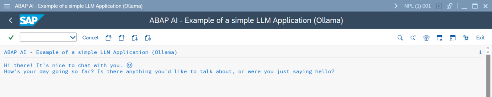
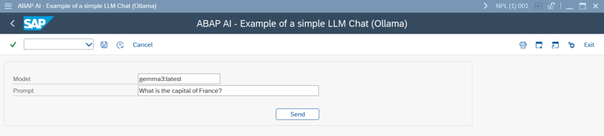
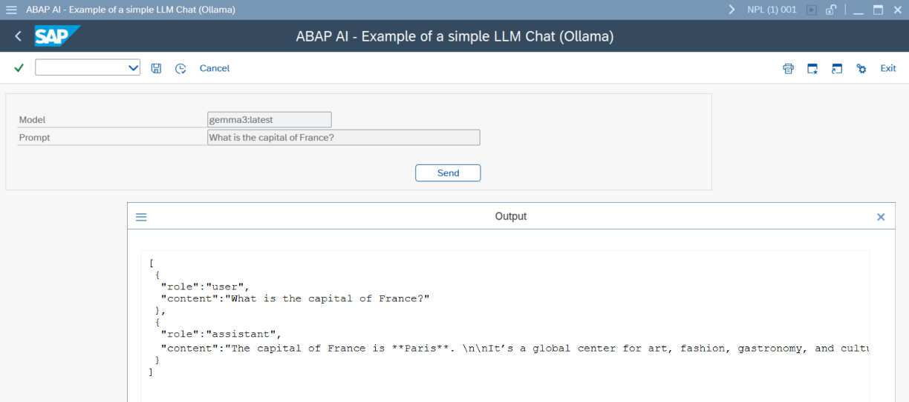
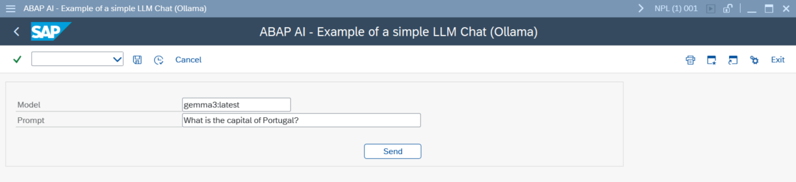
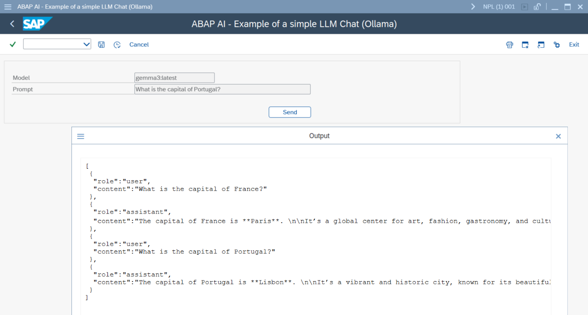

# yaai - ABAP AI tools - Ollama

<p>
  
</p>

## Quickstart

### Running Your First ABAP AI Ollama Application

This quickstart demonstrates how to create a simple LLM application. It shows you how to connect to the LLM and perform a basic chat interaction.

**Requirements:** 
- You must have [Ollama](https://ollama.com/download) installed and running locally or accessible on your network.

**Steps:**
1.  Create an ABAP AI Connection instance;
2.  Set the Base URL;
4.  Create an ABAP AI Ollama instance;
5.  Call the CHAT method.

**Example:**

```abap
REPORT yaai_r_simple_llm_app_ollama.

START-OF-SELECTION.

  DATA(o_aai_conn) = NEW ycl_aai_conn( ).

  " Replace the <ollama-host> with the hostname or IP address and port of your Ollama server
  o_aai_conn->set_base_url( i_base_url = 'http://<ollama-host>/ollama' ).

  "This example uses the Gemma3 model from Google
  DATA(o_aai_ollama) = NEW ycl_aai_ollama( i_model = 'gemma3:latest' i_o_connection = o_aai_conn ).

  o_aai_ollama->chat(
    EXPORTING
      i_message    = 'Hi, there!'
    IMPORTING
      e_t_response = DATA(t_response)
  ).

  LOOP AT t_response INTO DATA(l_response_line).

    WRITE: / l_response_line.

  ENDLOOP.
``` 

**Result:**

The following screenshot shows the output you can expect after running the example ABAP AI Ollama report. The response from the LLM will be displayed line by line in the SAP GUI output window.




### Running a simple ABAP AI Ollama Chat Application

The ABAP AI Chat stores all conversation exchanges in memory. At any time, you can retrieve the full conversation history, allowing you to review previous messages or continue the dialogue seamlessly.

```abap
REPORT yaai_r_simple_llm_chat_ollama.

SELECTION-SCREEN BEGIN OF BLOCK b1 WITH FRAME.

PARAMETERS: p_model  TYPE string DEFAULT 'gemma3:latest' LOWER CASE VISIBLE LENGTH 20,
            p_prompt TYPE string DEFAULT 'What is the capital of France?' LOWER CASE VISIBLE LENGTH 50.

SELECTION-SCREEN: SKIP 1,

BEGIN OF LINE,
PUSHBUTTON 68(10) button USER-COMMAND cli1,
END OF LINE.

SELECTION-SCREEN END OF BLOCK b1.

INITIALIZATION.

  "Set text for the selection screen fields and button
  %_p_model_%_app_%-text = 'Model'.
  %_p_prompt_%_app_%-text = 'Prompt'.
  button = 'Send'.

  DATA(o_aai_conn) = NEW ycl_aai_conn( ).

  " Replace the <ollama-host> with the hostname or IP address and port of your Ollama server
  o_aai_conn->set_base_url( i_base_url = 'http://<ollama-host>/ollama' ).

  DATA(o_aai_ollama) = NEW ycl_aai_ollama( i_model = p_model i_o_connection = o_aai_conn ).


AT SELECTION-SCREEN.

  o_aai_ollama->chat(
    EXPORTING
      i_message = p_prompt
  ).

  DATA(json) = /ui2/cl_json=>serialize(
    EXPORTING
      data        = o_aai_ollama->get_chat_messages( )
      compress    = abap_true
      pretty_name = abap_true

  ).

  IF json IS NOT INITIAL.

    cl_demo_output=>display_json( json ).

  ENDIF.
``` 

**Result:**

The following screenshots show the output you can expect after running the example ABAP AI Chat report.










Now that you've run your first Ollama ABAP AI applications, consider exploring additional features.😊

## Explore ABAP AI Features
  - **Prompt Templates:** Learn how to define and use [prompt templates](../prompt_templates.md) for more dynamic and reusable prompts.
  - **LLM System Instructions:** Pass [system instructions](system_instructions.md) to guide the behavior of the language model for specific tasks.
  - **Tool/Function Calling:** Enable LLM applications to trigger ABAP logic using [tools](function_calling.md).
  - **Retrieval-Augmented Generation (RAG):** Enhance your LLM applications by incorporating [external knowledge sources and retrieval mechanisms](../rag.md).

## Ollama API Documentation
  - [GitHub](https://github.com/ollama/ollama/blob/main/docs/api.md)    