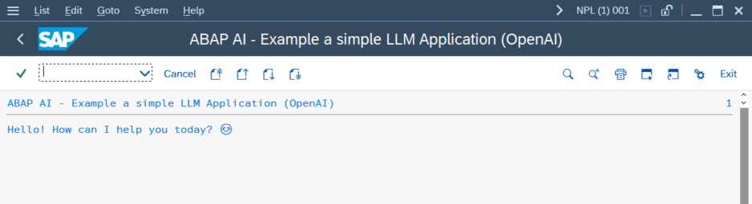
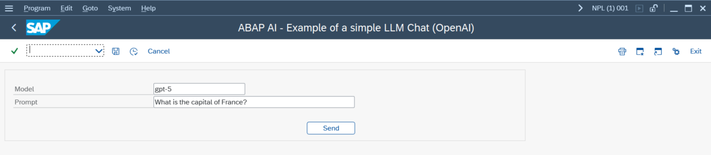
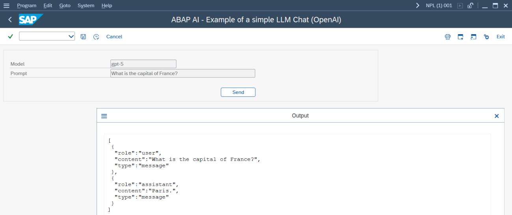
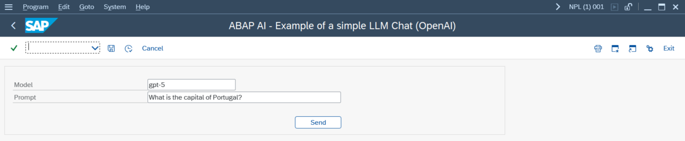
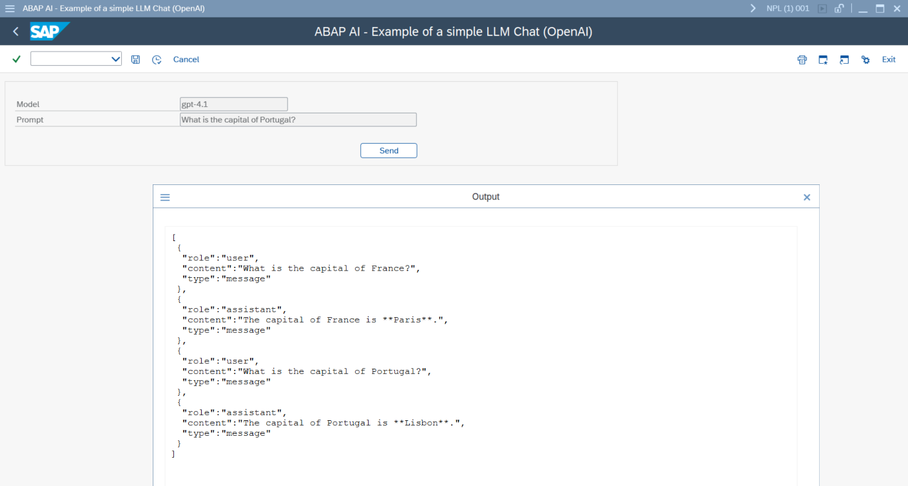

# yaai - ABAP AI tools - OpenAI

<p>
  <svg width="100" height="100" viewBox="0 0 20 20" fill="currentColor" xmlns="http://www.w3.org/2000/svg" class="icon-lg"><path d="M11.2475 18.25C10.6975 18.25 10.175 18.1455 9.67999 17.9365C9.18499 17.7275 8.74499 17.436 8.35999 17.062C7.94199 17.205 7.50749 17.2765 7.05649 17.2765C6.31949 17.2765 5.63749 17.095 5.01049 16.732C4.38349 16.369 3.87749 15.874 3.49249 15.247C3.11849 14.62 2.93149 13.9215 2.93149 13.1515C2.93149 12.8325 2.97549 12.486 3.06349 12.112C2.62349 11.705 2.28249 11.2375 2.04049 10.7095C1.79849 10.1705 1.67749 9.6095 1.67749 9.0265C1.67749 8.4325 1.80399 7.8605 2.05699 7.3105C2.30999 6.7605 2.66199 6.2875 3.11299 5.8915C3.57499 5.4845 4.10849 5.204 4.71349 5.05C4.83449 4.423 5.08749 3.862 5.47249 3.367C5.86849 2.861 6.35249 2.465 6.92449 2.179C7.49649 1.893 8.10699 1.75 8.75599 1.75C9.30599 1.75 9.82849 1.8545 10.3235 2.0635C10.8185 2.2725 11.2585 2.564 11.6435 2.938C12.0615 2.795 12.496 2.7235 12.947 2.7235C13.684 2.7235 14.366 2.905 14.993 3.268C15.62 3.631 16.1205 4.126 16.4945 4.753C16.8795 5.38 17.072 6.0785 17.072 6.8485C17.072 7.1675 17.028 7.514 16.94 7.888C17.38 8.295 17.721 8.768 17.963 9.307C18.205 9.835 18.326 10.3905 18.326 10.9735C18.326 11.5675 18.1995 12.1395 17.9465 12.6895C17.6935 13.2395 17.336 13.718 16.874 14.125C16.423 14.521 15.895 14.796 15.29 14.95C15.169 15.577 14.9105 16.138 14.5145 16.633C14.1295 17.139 13.651 17.535 13.079 17.821C12.507 18.107 11.8965 18.25 11.2475 18.25ZM7.17199 16.1875C7.72199 16.1875 8.20049 16.072 8.60749 15.841L11.7095 14.059C11.8195 13.982 11.8745 13.8775 11.8745 13.7455V12.3265L7.88149 14.62C7.63949 14.763 7.39749 14.763 7.15549 14.62L4.03699 12.8215C4.03699 12.8545 4.03149 12.893 4.02049 12.937C4.02049 12.981 4.02049 13.047 4.02049 13.135C4.02049 13.696 4.15249 14.213 4.41649 14.686C4.69149 15.148 5.07099 15.511 5.55499 15.775C6.03899 16.05 6.57799 16.1875 7.17199 16.1875ZM7.33699 13.498C7.40299 13.531 7.46349 13.5475 7.51849 13.5475C7.57349 13.5475 7.62849 13.531 7.68349 13.498L8.92099 12.7885L4.94449 10.4785C4.70249 10.3355 4.58149 10.121 4.58149 9.835V6.2545C4.03149 6.4965 3.59149 6.8705 3.26149 7.3765C2.93149 7.8715 2.76649 8.4215 2.76649 9.0265C2.76649 9.5655 2.90399 10.0825 3.17899 10.5775C3.45399 11.0725 3.81149 11.4465 4.25149 11.6995L7.33699 13.498ZM11.2475 17.161C11.8305 17.161 12.3585 17.029 12.8315 16.765C13.3045 16.501 13.6785 16.138 13.9535 15.676C14.2285 15.214 14.366 14.697 14.366 14.125V10.561C14.366 10.429 14.311 10.33 14.201 10.264L12.947 9.538V14.1415C12.947 14.4275 12.826 14.642 12.584 14.785L9.46549 16.5835C10.0045 16.9685 10.5985 17.161 11.2475 17.161ZM11.8745 11.122V8.878L10.01 7.822L8.12899 8.878V11.122L10.01 12.178L11.8745 11.122ZM7.05649 5.8585C7.05649 5.5725 7.17749 5.358 7.41949 5.215L10.538 3.4165C9.99899 3.0315 9.40499 2.839 8.75599 2.839C8.17299 2.839 7.64499 2.971 7.17199 3.235C6.69899 3.499 6.32499 3.862 6.04999 4.324C5.78599 4.786 5.65399 5.303 5.65399 5.875V9.4225C5.65399 9.5545 5.70899 9.659 5.81899 9.736L7.05649 10.462V5.8585ZM15.4385 13.7455C15.9885 13.5035 16.423 13.1295 16.742 12.6235C17.072 12.1175 17.237 11.5675 17.237 10.9735C17.237 10.4345 17.0995 9.9175 16.8245 9.4225C16.5495 8.9275 16.192 8.5535 15.752 8.3005L12.6665 6.5185C12.6005 6.4745 12.54 6.458 12.485 6.469C12.43 6.469 12.375 6.4855 12.32 6.5185L11.0825 7.2115L15.0755 9.538C15.1965 9.604 15.2845 9.692 15.3395 9.802C15.4055 9.901 15.4385 10.022 15.4385 10.165V13.7455ZM12.122 5.3635C12.364 5.2095 12.606 5.2095 12.848 5.3635L15.983 7.195C15.983 7.118 15.983 7.019 15.983 6.898C15.983 6.37 15.851 5.8695 15.587 5.3965C15.334 4.9125 14.9655 4.5275 14.4815 4.2415C14.0085 3.9555 13.4585 3.8125 12.8315 3.8125C12.2815 3.8125 11.803 3.928 11.396 4.159L8.29399 5.941C8.18399 6.018 8.12899 6.1225 8.12899 6.2545V7.6735L12.122 5.3635Z"></path></svg>
</p>

## Quickstart

### Running Your First ABAP AI OpenAI Application

This quickstart demonstrates how to create a simple LLM application. It shows you how to connect to the LLM and perform a basic chat interaction.

**Requirements:** 
*   You have a valid OpenAI API Key.
*   Import OpenAI server certificates into SAP trust manager. The [abapGit documentation](https://docs.abapgit.org/user-guide/setup/ssl-setup.html) explains in detail how to do it.

    **Note**: To run the application on SAP NetWeaver AS ABAP Developer Edition, we recommend using NGINX as a reverse proxy to expose a local HTTP endpoint—it’s much simpler than manually configuring SSL on the SAP system.

**Steps:**
1.  Create an ABAP AI Connection instance;
2.  Set the Base URL;
3.  Set the API Key;
4.  Create an ABAP AI OpenAI instance;
5.  Call the CHAT method.

**Example:**

```abap
REPORT yaai_r_simple_llm_app_openai LINE-SIZE 500.

START-OF-SELECTION.

  DATA(o_aai_conn) = NEW ycl_aai_conn( ).

  " The hardcoded base URL in this example is intended for testing and development only. 
  o_aai_conn->set_base_url( i_base_url = 'https://api.openai.com' ).
 
  " The hardcoded API key in this example is intended for testing and development only.
  " Hardcoding API keys directly into your ABAP code is highly discouraged.
  o_aai_conn->set_api_key( i_api_key = 'REPLACE_THIS_TEXT_WITH_YOUR_OPENAI_API_KEY' ).

  DATA(o_aai_openai) = NEW ycl_aai_openai( i_model = 'gpt-4.1' i_o_connection = o_aai_conn ).

  o_aai_openai->chat(
    EXPORTING
      i_message    = 'Hi, there!'
    IMPORTING
      e_t_response = DATA(t_response)
  ).

  " Display the LLM response on the screen
  LOOP AT t_response INTO DATA(l_response_line).
    WRITE: / l_response_line.
  ENDLOOP.
``` 

**Result:**

The following screenshot shows the output you can expect after running the example ABAP AI report. The response from the LLM will be displayed line by line in the SAP GUI output window.




### Running a simple ABAP AI OpenAI Chat Application

The ABAP AI Chat stores all conversation exchanges in memory. At any time, you can retrieve the full conversation history, allowing you to review previous messages or continue the dialogue seamlessly.

```abap
REPORT yaai_r_simple_llm_chat_openai.

SELECTION-SCREEN BEGIN OF BLOCK b1 WITH FRAME.

PARAMETERS: p_model  TYPE string DEFAULT 'gpt-4.1' LOWER CASE VISIBLE LENGTH 20,
            p_prompt TYPE string DEFAULT 'What is the capital of France?' LOWER CASE VISIBLE LENGTH 50.

SELECTION-SCREEN: SKIP 1,

BEGIN OF LINE,
PUSHBUTTON 68(10) button USER-COMMAND cli1,
END OF LINE.
SELECTION-SCREEN END OF BLOCK b1.

INITIALIZATION.

  "Set text for the selection screen fields and button
  %_p_model_%_app_%-text = 'Model'.
  %_p_prompt_%_app_%-text = 'Prompt'.
  button = 'Send'.

  DATA(o_aai_conn) = NEW ycl_aai_conn( ).

  o_aai_conn->set_base_url( i_base_url = 'https://api.openai.com' ).

  " The hardcoded API key in this example is intended for testing and development only.
  " Hardcoding API keys directly into your ABAP code is highly discouraged.
  o_aai_conn->set_api_key( i_api_key = 'REPLACE_THIS_TEXT_WITH_YOUR_OPENAI_API_KEY' ).

  DATA(o_aai_openai) = NEW ycl_aai_openai( i_model = p_model i_o_connection = o_aai_conn ).


AT SELECTION-SCREEN.

  o_aai_openai->chat(
    EXPORTING
      i_message = p_prompt
  ).

  DATA(json) = /ui2/cl_json=>serialize(
    EXPORTING
      data        = o_aai_openai->get_conversation( )
      compress    = abap_true
      pretty_name = abap_true

  ).

  IF json IS NOT INITIAL.

    cl_demo_output=>display_json( json ).

  ENDIF.
``` 

**Result:**

The following screenshots show the output you can expect after running the example ABAP AI Chat report.










Now that you've run your first OpenAI ABAP AI applications, consider exploring additional features.😊

## Explore ABAP AI Features
  - **Prompt Templates:** Learn how to define and use [prompt templates](prompt_templates.md) for more dynamic and reusable prompts.
  - **LLM System Instructions:** Pass [system instructions](system_instructions.md) to guide the behavior of the language model for specific tasks.
  - **Tool/Function Calling:** Enable LLM applications to trigger ABAP logic or workflows.
  - **Retrieval-Augmented Generation (RAG):** Enhance your LLM applications by incorporating external knowledge sources and retrieval mechanisms.

## OpenAI API Documentation
  - [OpenAI developer platform](https://platform.openai.com/docs/overview)  