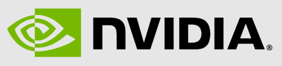

# yaai - ABAP AI tools - Nvidia

<p>
  
</p>

**Website**: https://build.nvidia.com/

## Quickstart

### Running Your First ABAP AI Nvidia Application

This quickstart demonstrates how to create a simple LLM application. It shows you how to connect to the LLM and perform a basic chat interaction.

**Requirements:** 
*   You have a valid Nvidia API Key.
*   Import OpenAI server certificates into SAP trust manager. The [abapGit documentation](https://docs.abapgit.org/user-guide/setup/ssl-setup.html) explains in detail how to do it.

**Steps:**
1.  Create an ABAP AI Connection instance;
2.  Set the Base URL;
3.  Set the API Key;
4.  Create an ABAP AI OpenAI instance;
5.  Call the CHAT method.

**Example:**

```abap
REPORT yaai_r_simple_llm_app_nvidia LINE-SIZE 500.

START-OF-SELECTION.

  DATA(o_aai_conn) = NEW ycl_aai_conn( ).

  o_aai_conn->set_base_url( i_base_url = 'https://integrate.api.nvidia.com' ).

  o_aai_conn->set_api_key( i_api_key = 'REPLACE_THIS_TEXT_WITH_YOUR_OPENAI_API_KEY' ).

  " The Nvidia API does not accept the 'charset=utf-8' so the workaround is to suppress the content type
  " {"error":"Unsupported media type: application/json; charset=utf-8. It must be application/json"}
  o_aai_conn->yif_aai_conn~suppress_content_type( ).

  DATA(o_aai_openai) = NEW ycl_aai_openai( i_model = 'nvidia/llama-3.3-nemotron-super-49b-v1'
                                           i_o_connection = o_aai_conn ).

  o_aai_openai->use_completions( ).

  o_aai_openai->chat(
    EXPORTING
      i_message    = 'Hi, there! It is nice to meet you 😊'
    IMPORTING
      e_t_response = DATA(t_response)
  ).

  LOOP AT t_response INTO DATA(l_response_line).

    WRITE: / l_response_line.

  ENDLOOP.
``` 

**Result:**

The following screenshot shows the output you can expect after running the example ABAP AI report. The response from the LLM will be displayed line by line in the SAP GUI output window.


